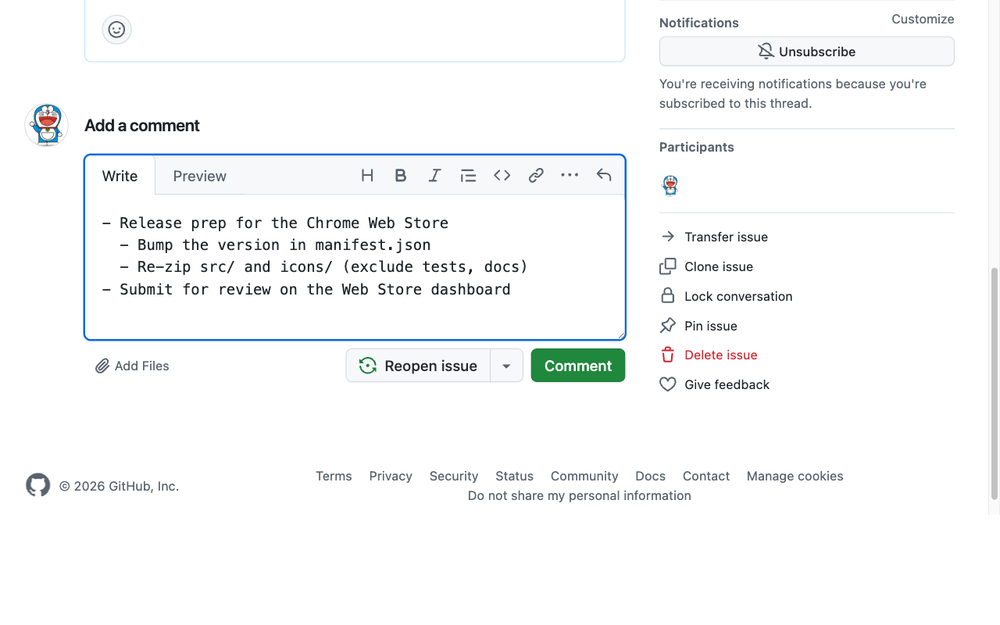
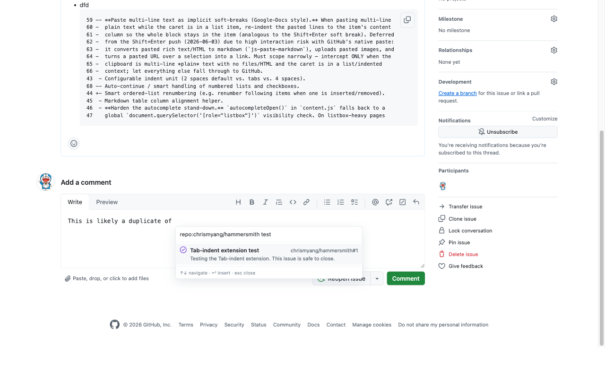
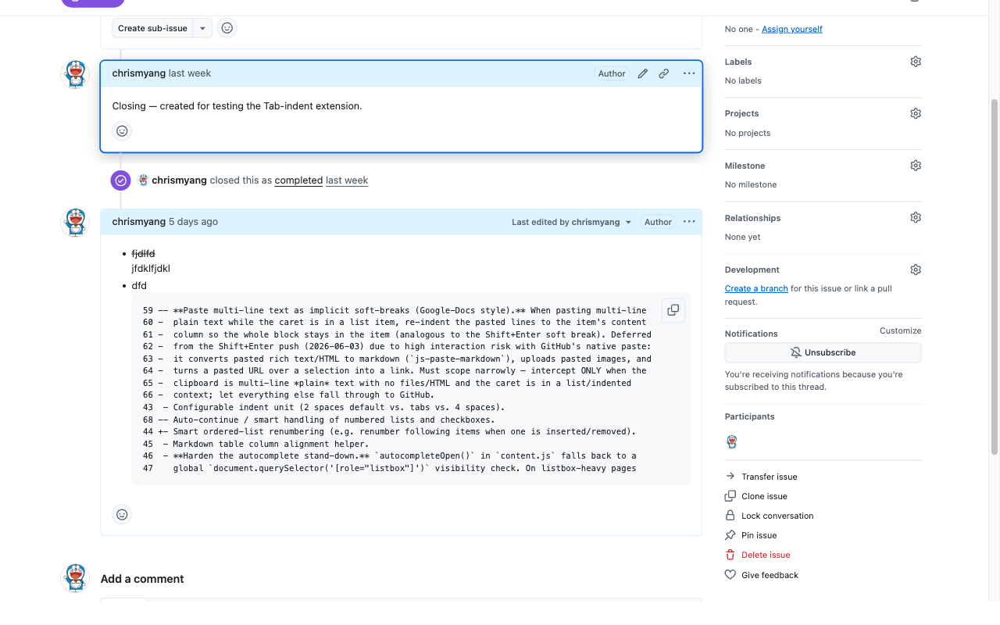

# GitHub Enhancement Suite

A Chrome extension that makes writing on GitHub feel like a real editor — list-aware
indenting, a monospace composer, in-box issue search, and one-key comment editing.

It **enhances GitHub's own Markdown editor in place** — it does *not* replace it. Your
`@`-mentions, `#`-references, `:emoji:` autocomplete, image upload, Markdown preview, and
⌘/Ctrl-Enter submit all keep working exactly as before. Every edit is undo-safe: a single
⌘/Ctrl-Z reverses anything the extension does.

Works in issue and pull-request comments and descriptions, the Projects issue side-pane, and
both the classic and the React/Primer editors.

---

## Install

**Chrome Web Store:** _pending review — link coming soon._

**Manually (load unpacked):**

1. [Download this repo as a ZIP](https://github.com/chrismyang/github-enhancement-suite/archive/refs/heads/main.zip) and unzip it (or `git clone` it).
2. Open `chrome://extensions` and turn on **Developer mode** (top-right).
3. Click **Load unpacked** and select the project folder (the one containing `manifest.json`).
4. Open any GitHub comment box and start typing.

There is no build step — the extension is plain JS/CSS and ships as-is.

---

## Screenshots

**List-aware indenting in a monospace editor**



**Issue & PR search, right in the box (`Ctrl+;`)**



**Quick-edit any comment — hover and press `e`**



---

## Features

- **List-aware indenting.** <kbd>Tab</kbd> / <kbd>Shift</kbd>+<kbd>Tab</kbd> indent and outdent
  the current list item (or selection) instead of tabbing out of the box. <kbd>Enter</kbd>
  continues the list with the next bullet, number, or task-list checkbox;
  <kbd>Shift</kbd>+<kbd>Enter</kbd> adds a soft line break inside the same item.
- **Monospace editor font.** Markdown textareas render in monospace, so tables, code, and
  indentation line up while you type.
- **Issue-link search.** Press <kbd>Ctrl</kbd>+<kbd>;</kbd> to search issues and pull requests
  without leaving the box — a panel opens at your cursor, and picking a result inserts the
  reference. Searches run against GitHub on your own session.
- **Quick-edit.** Hover any of your own comments or descriptions and press <kbd>e</kbd> to jump
  straight into GitHub's native edit mode, or <kbd>c</kbd> to copy a link to it. A small
  toolbar in the comment header offers the same, with tooltips that teach the shortcuts.
- **Wrap the selection.** With text selected, type a wrapping character (`` ` ``, `*`, `_`,
  `(`, `[`, `{`, …) to wrap it instead of replacing it — quick bold, italic, code, and
  brackets.
- **Smart paste.** Pasting multi-line text into a list item keeps it aligned to the item.

### Keyboard shortcuts

| Shortcut | Action |
| --- | --- |
| <kbd>Tab</kbd> / <kbd>Shift</kbd>+<kbd>Tab</kbd> | Indent / outdent the current list item or selection |
| <kbd>Enter</kbd> | Continue the list (next bullet, number, or checkbox) |
| <kbd>Shift</kbd>+<kbd>Enter</kbd> | Soft line break inside the current item |
| <kbd>Ctrl</kbd>+<kbd>;</kbd> | Search issues / PRs and insert a reference |
| <kbd>e</kbd> | Edit the comment under the cursor |
| <kbd>c</kbd> | Copy a link to the comment under the cursor |
| `` ` `` `*` `_` `(` `[` `{` … | Wrap the current selection |

---

## Privacy

This extension collects **no data** and sends nothing to any third party. It runs only on
`github.com` and talks only to GitHub, using your existing logged-in session. There are no
accounts, no analytics, and no tracking. See [`manifest.json`](manifest.json) — the only host
it touches is `https://github.com/*`.

---

## How it works

The extension adds a single capture-phase keyboard/paste listener on the document and enhances
GitHub's native textareas through standard, undo-safe edits (`document.execCommand`), which is
why a single undo reverses its changes and the React-controlled editor stays in sync. When
GitHub's `@`/`#` autocomplete is open, the extension stands down so its keys reach GitHub. If
GitHub ever changes its layout, every mutation path falls back to default behavior rather than
breaking the box.

---

## Development

No dependencies, no bundler. Requires Node ≥ 18 for the test runner.

```bash
npm test                 # run the unit suite (node --test)
node --check src/<f>.js   # syntax-check a file after editing
npm run package          # build a store-ready zip in dist/
```

The editing *logic* lives in pure, DOM-free modules (`src/indent.js`, `src/issue-search.js`)
that are fully unit-tested. The DOM/event glue (`src/content.js`, `src/issue-search-ui.js`,
`src/quick-edit.js`) is verified live against real GitHub. Design docs for each feature live in
[`docs/superpowers/specs/`](docs/superpowers/specs/).

---

## Contributing

Issues and pull requests are welcome. This is a small personal project; please open an issue to
discuss larger changes before sending a PR. Run `npm test` before submitting.

---

## License

MIT — see [LICENSE](LICENSE).
